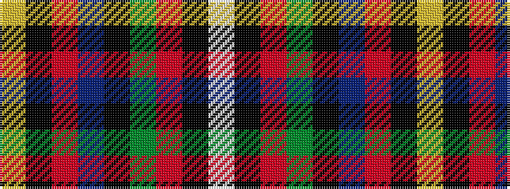

WKRGKBRKY

It is a 9 stripe tartan.

<figure class="pat-woven">

<figcaption>idealised sample</figcaption>
</figure>

## Colour Sequence



## Tartans with this colour sequence

| Tartans |
|---------------|
| [Loch Awe](/variants/s9/ly3k2r3db20k24g20r3k2lb3~x2/)|
||
