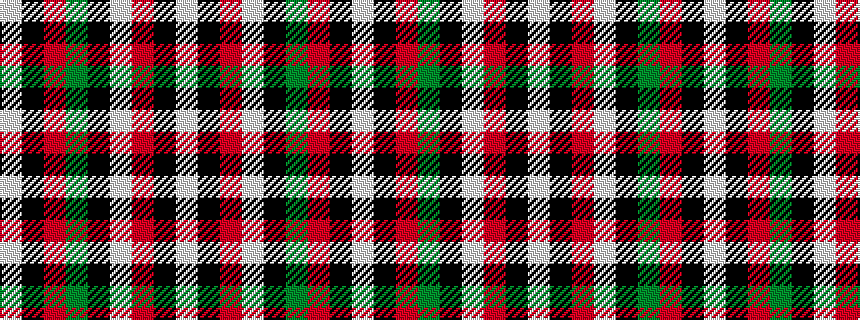

WKRGKWRKW

It is a 9 stripe tartan.

<figure class="pat-woven">

<figcaption>idealised sample</figcaption>
</figure>

## Colour Sequence



## Tartans with this colour sequence

| Tartans |
|---------------|
| [Graham of Montrose Red](/variants/s9/lb1k1r10g10k5lb5r10k1lb1~x4/)|
||
| [Montrose](/variants/s9/lb2k2r14dg15k8lb7r14k2lb2/)|
||
