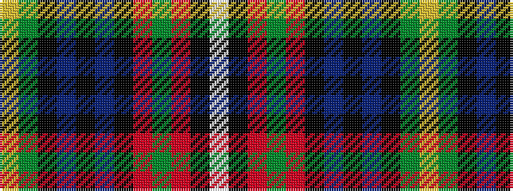

WKRGRKBKBKGY

It is a 12 stripe tartan.

<figure class="pat-woven">

<figcaption>idealised sample</figcaption>
</figure>

## Colour Sequence



## Tartans with this colour sequence

| Tartans |
|---------------|
| [Boyd](/variants/s12/w5k4r4g5r38k10db2k2db2k2g22ly5~x2/)|
||
| [Boyd](/variants/s12/ly5dg22k2db2k2db2k10r38dg5r4k4lb5/)|
||
| [Boyd](/variants/s12/w1k1r1g1r12k6db1k1db1k1g6ly1~x4/)|
||
