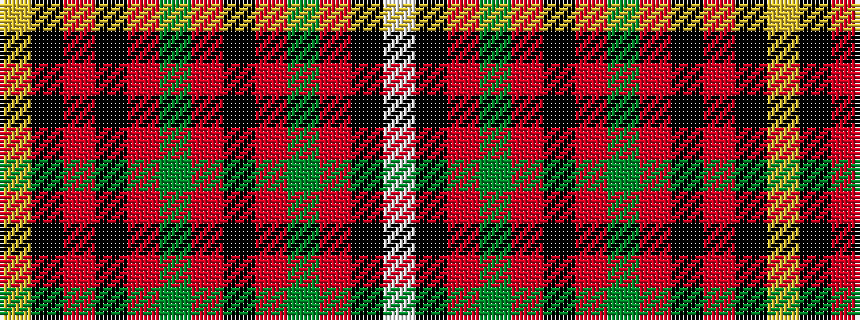

WKRGRKRGRKRKY

It is a 13 stripe tartan.

<figure class="pat-woven">

<figcaption>idealised sample</figcaption>
</figure>

## Colour Sequence



## Tartans with this colour sequence

| Tartans |
|---------------|
| [Robieson](/variants/s13/w1k1r8dg1r1ki8r1dg8r1ki1r8k1ly1~x6/)|
||
