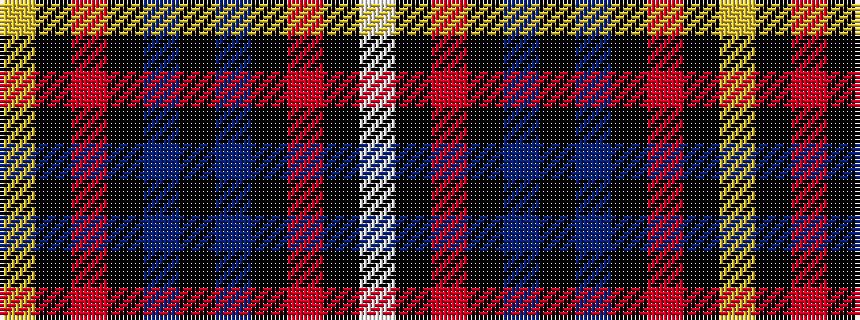

WKRKBKBKRKY

It is a 11 stripe tartan.

<figure class="pat-woven">

<figcaption>idealised sample</figcaption>
</figure>

## Colour Sequence



## Tartans with this colour sequence

| Tartans |
|---------------|
| [Mount Isla](/variants/s11/lo2k1r6k2db7k2db7k2r7k1lb2~x4/)|
||
