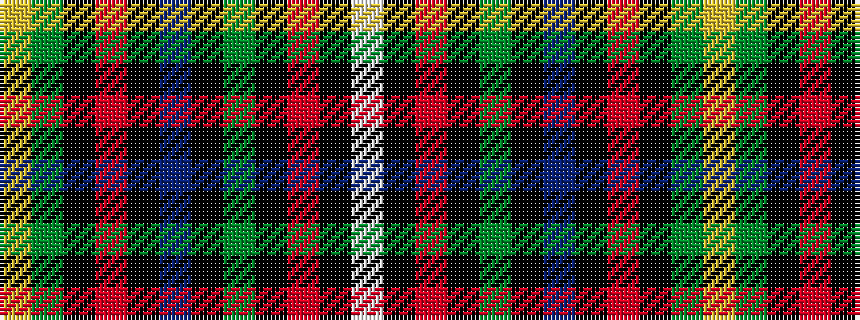

WKRKGKBKRKGY

It is a 12 stripe tartan.

<figure class="pat-woven">

<figcaption>idealised sample</figcaption>
</figure>

## Colour Sequence



## Tartans with this colour sequence

| Tartans |
|---------------|
| [Tait #2](/setts/s12/w4k1r2k1g9k2b24k2r6k2g12ly2~x2/)|
||
