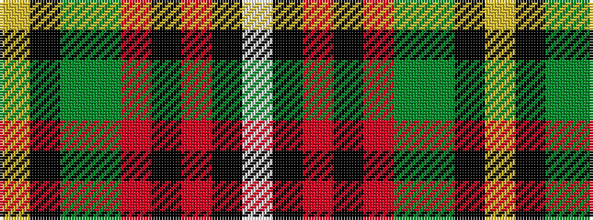

WKRKRGGKY

It is a 9 stripe tartan.

<figure class="pat-woven">

<figcaption>idealised sample</figcaption>
</figure>

## Colour Sequence



## Tartans with this colour sequence

| Tartans |
|---------------|
| [Thirkill](/setts/s9/w4k2r15k2r5y7dg7k2ly4~x2/)|
||
