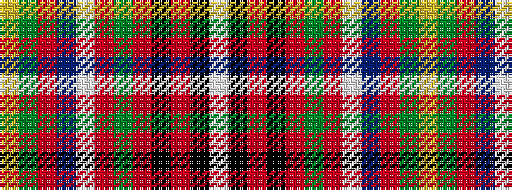

WKRKRGRWBRGY

It is a 12 stripe tartan.

<figure class="pat-woven">

<figcaption>idealised sample</figcaption>
</figure>

## Colour Sequence



## Tartans with this colour sequence

| Tartans |
|---------------|
| [Gordonstoun (Corporate)](/variants/s12/ly5g19r2t11lb2r11g11r2k20r2k2lb2~x2/)|
||
