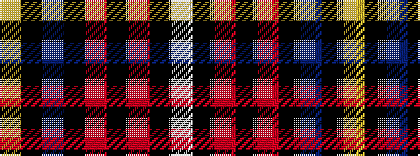

WKRKRKBKY

It is a 9 stripe tartan.

<figure class="pat-woven">

<figcaption>idealised sample</figcaption>
</figure>

## Colour Sequence



## Tartans with this colour sequence

| Tartans |
|---------------|
| [Castle Stewart (District)](/variants/s9/lo7k3db4k3r21k2r4k2w4~x2/)|
||
