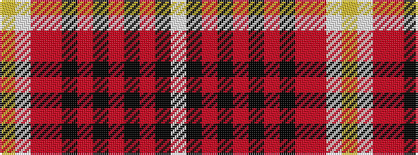

WKRKRKRKRRWY

It is a 12 stripe tartan.

<figure class="pat-woven">

<figcaption>idealised sample</figcaption>
</figure>

## Colour Sequence



## Tartans with this colour sequence

| Tartans |
|---------------|
| [Aberdeen Forever (District)](/variants/s12/ly4w2r16o8k1o3k2o2k3o2k22lb4~x2/)|
||
