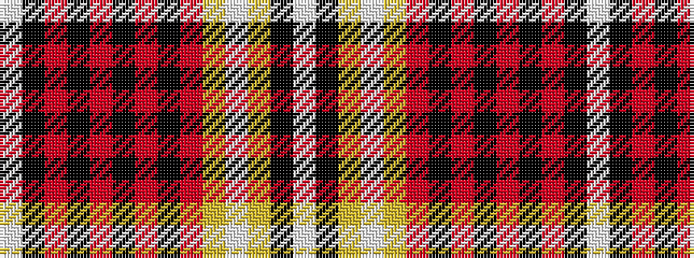

WKRKRKRKRYWYKW

It is a 14 stripe tartan.

<figure class="pat-woven">

<figcaption>idealised sample</figcaption>
</figure>

## Colour Sequence



## Tartans with this colour sequence

| Tartans |
|---------------|
| [Avalon - Stewart House](/variants/s14/w3k1r15k6r5k3r8k2r5ly3w2ly4k1w3~x2/)|
||
| [Avalon - Washington House](/variants/s14/w3k1o15k6o5k3o8k2o5ly3w2ly4k1w3~x2/)|
||
