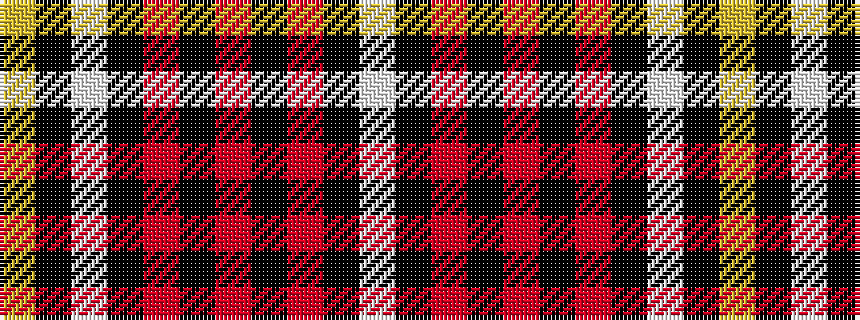

WKRKRKRKWKY

It is a 11 stripe tartan.

<figure class="pat-woven">

<figcaption>idealised sample</figcaption>
</figure>

## Colour Sequence



## Tartans with this colour sequence

| Tartans |
|---------------|
| [MacCandlish Arisaid Red](/variants/s11/lbi3k1r12k1r1k2r1k6lb12k1lo1~x4/)|
||
| [McCandlish Arisaid, Red (Name)](/variants/s11/lb3k1r12k1r1k2r1k6w12k1lo1~x4/)|
||
