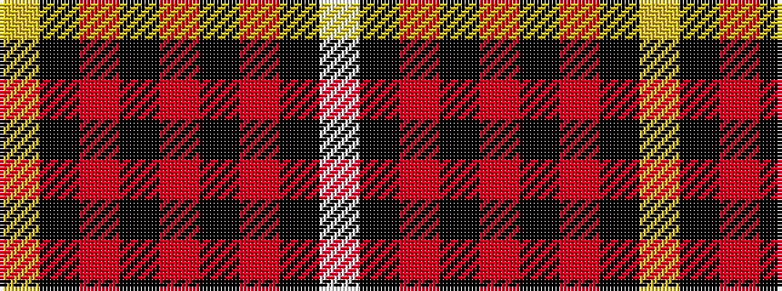

WKRKRKRKY

It is a 9 stripe tartan.

<figure class="pat-woven">

<figcaption>idealised sample</figcaption>
</figure>

## Colour Sequence



## Tartans with this colour sequence

| Tartans |
|---------------|
| [Maciver of Strathendry Castle Dress (Personal)](/variants/s9/w1k3r3k24r3k3r24k3ly1~x2/)|
||
