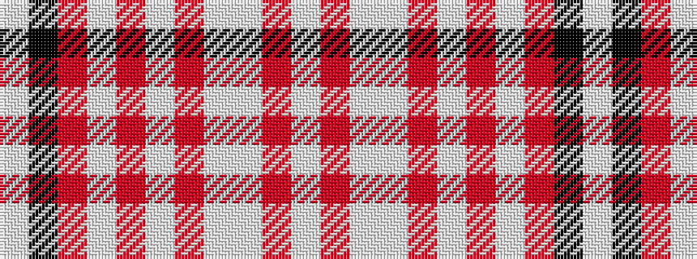

WKRWRWRWWRW

It is a 11 stripe tartan.

<figure class="pat-woven">

<figcaption>idealised sample</figcaption>
</figure>

## Colour Sequence



## Tartans with this colour sequence

| Tartans |
|---------------|
| [Bourbon, Sebastien (Personal)](/setts/s11/w2k2o4w4o5wi4o3wi50w2r2w2~x2/)|
||
