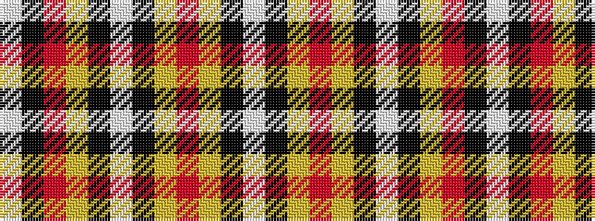

WKRYKWKYRYKW

It is a 12 stripe tartan.

<figure class="pat-woven">

<figcaption>idealised sample</figcaption>
</figure>

## Colour Sequence



## Tartans with this colour sequence

| Tartans |
|---------------|
| [Normandy (Fashion)](/setts/s12/w8k9ly9r21ly6k6w4k6ly6r49k22w4/)|
||
