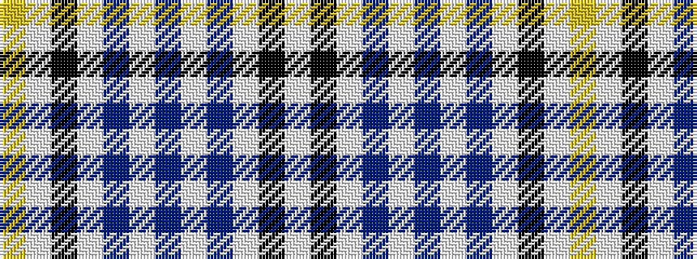

WKWBWBWBWKWY

It is a 12 stripe tartan.

<figure class="pat-woven">

<figcaption>idealised sample</figcaption>
</figure>

## Colour Sequence



## Tartans with this colour sequence

| Tartans |
|---------------|
| [Moskyok-Collins (Personal)](/variants/s12/lo6w2k4lb1dt6lb1b40lb1dt6lb1k4w4~x2/)|
||
