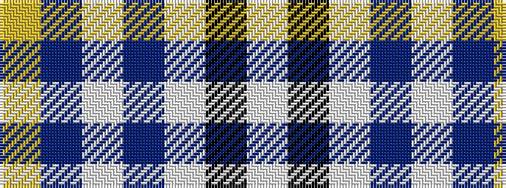

WKWBWBY

It is a 7 stripe tartan.

<figure class="pat-woven">

<figcaption>idealised sample</figcaption>
</figure>

## Colour Sequence



## Tartans with this colour sequence

| Tartans |
|---------------|
| [MacPherson Dress Blue (Dance)](/variants/s7/w5k3w26db21w3db8ly3~x2/)|
||
