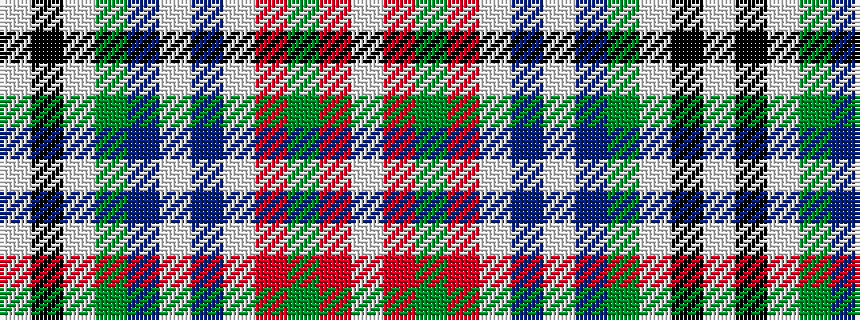

WKWGBWBWRGRW

It is a 12 stripe tartan.

<figure class="pat-woven">

<figcaption>idealised sample</figcaption>
</figure>

## Colour Sequence



## Tartans with this colour sequence

| Tartans |
|---------------|
| [Grant of Achnarrow Error 1983](/setts/s12/w14k3w28g6db4w2db2w14r12g3r4w4~x2/)|
||
