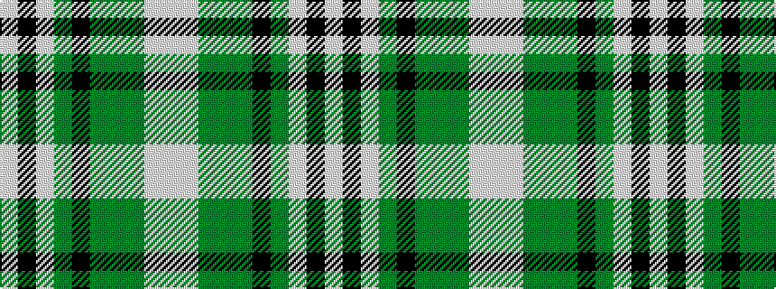

WKWGKGGGWW

It is a 10 stripe tartan.

<figure class="pat-woven">

<figcaption>idealised sample</figcaption>
</figure>

## Colour Sequence



## Tartans with this colour sequence

| Tartans |
|---------------|
| [State Seal of Alaska (Fashion)](/setts/s10/lbi49k1lb33gi8k11g4gi19dy2lb12lbi4~x2/)|
||
