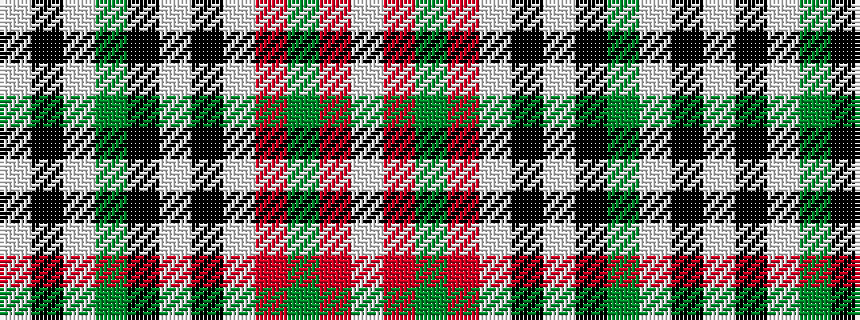

WKWGKWKWRGRW

It is a 12 stripe tartan.

<figure class="pat-woven">

<figcaption>idealised sample</figcaption>
</figure>

## Colour Sequence



## Tartans with this colour sequence

| Tartans |
|---------------|
| [Grant of Acharrow](/setts/s12/w12k3w28g6k4w2k2w14r11g3r4w4~x2/)|
||
