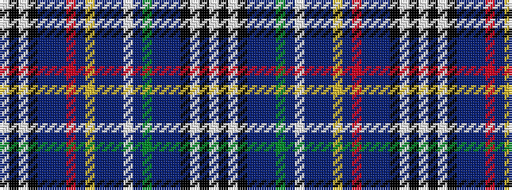

WKWKBBBGBWBBBYBRBBBKWKW

It is a 23 stripe tartan.

<figure class="pat-woven">

<figcaption>idealised sample</figcaption>
</figure>

## Colour Sequence



## Tartans with this colour sequence

| Tartans |
|---------------|
| [Progress Blue Lodge (Corporate)](/variants/s23/w4k4w4k2t12dp2t12r9t2ly6t2db11t2w6t2g9t12dp2t12k2w4k4w4~x2/)|
||
