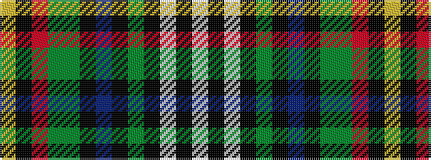

WKWKGKBKGGRKY

It is a 13 stripe tartan.

<figure class="pat-woven">

<figcaption>idealised sample</figcaption>
</figure>

## Colour Sequence



## Tartans with this colour sequence

| Tartans |
|---------------|
| [University of Hong Kong](/setts/s13/w2k1w2k1dg42k1t5k1g5dg6r2k1ly2~x2/)|
||
