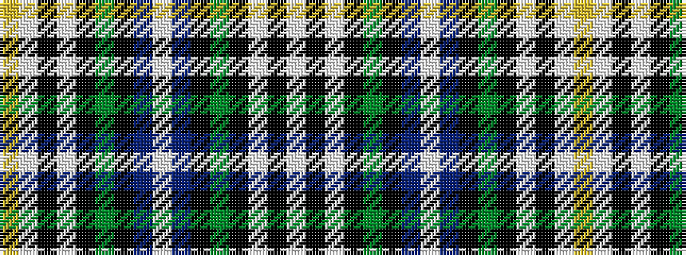

WKWKGKBWBKGKWKWY

It is a 16 stripe tartan.

<figure class="pat-woven">

<figcaption>idealised sample</figcaption>
</figure>

## Colour Sequence



## Tartans with this colour sequence

| Tartans |
|---------------|
| [Hoban (Personal)](/setts/s16/lp9k3lp4k9g15k9db11w2db11k9g15k9lp4k3lp9ly3~x4/)|
||
