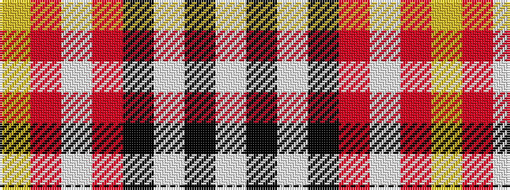

WKWKRWRY

It is a 8 stripe tartan.

<figure class="pat-woven">

<figcaption>idealised sample</figcaption>
</figure>

## Colour Sequence



## Tartans with this colour sequence

| Tartans |
|---------------|
| [Marjoribanks](/setts/s8/w3k3w3k36r40w1r2ly3~x2/)|
||
| [Marjoribanks (Clan)](/setts/s8/w3k3w3k37r40w1r2lo3~x2/)|
||
