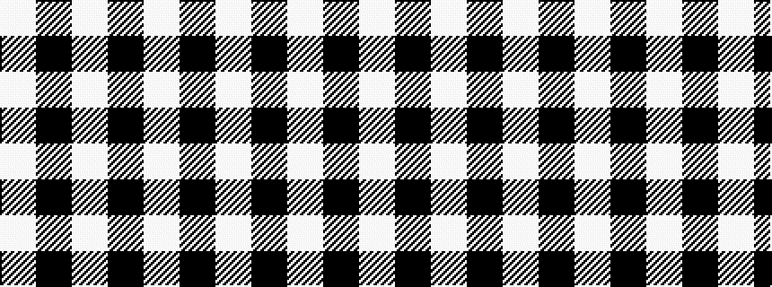

WKWKW

It is a 5 stripe tartan.

<figure class="pat-woven">

<figcaption>idealised sample</figcaption>
</figure>

## Colour Sequence



## Tartans with this colour sequence

| Tartans |
|---------------|
| [MacLeod Black & White](/variants/s5/w14k2w14k19w2~x2/)|
||
| [MacLeod, Black & White](/variants/s5/w8k1w8k12w1~x2/)|
||
