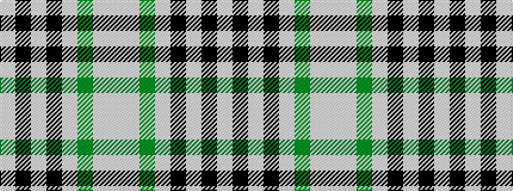

WKWKWGWW

It is a 8 stripe tartan.

<figure class="pat-woven">

<figcaption>idealised sample</figcaption>
</figure>

## Colour Sequence



## Tartans with this colour sequence

| Tartans |
|---------------|
| [Longniddry Turquoise (Dance)](/variants/s8/lb38k2w2k2lb5g10w30lb4~x2/)|
||
