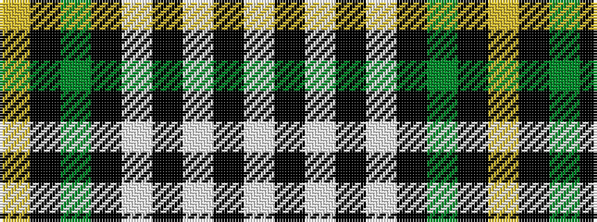

WKWKWKGKY

It is a 9 stripe tartan.

<figure class="pat-woven">

<figcaption>idealised sample</figcaption>
</figure>

## Colour Sequence



## Tartans with this colour sequence

| Tartans |
|---------------|
| [Gordon Dress (MacGregor-Hastie)](/variants/s9/w4k2w16k4w4k37dg12k4ly4~x2/)|
||
| [Gordon, dress 1](/variants/s9/w4k2w16k4w4k37g12k4ly4~x2/)|
||
