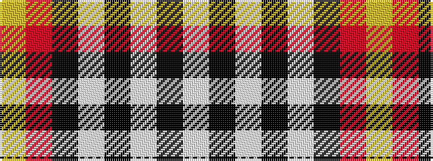

WKWKWKRY

It is a 8 stripe tartan.

<figure class="pat-woven">

<figcaption>idealised sample</figcaption>
</figure>

## Colour Sequence



## Tartans with this colour sequence

| Tartans |
|---------------|
| [Aberlour](/setts/s8/lb23k4lb4k4lb4k22o23lo5~x2/)|
||
