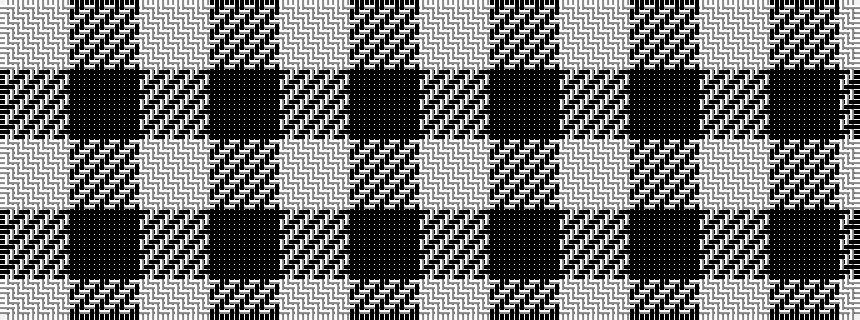

WKWKWKW

It is a 7 stripe tartan.

<figure class="pat-woven">

<figcaption>idealised sample</figcaption>
</figure>

## Colour Sequence



## Tartans with this colour sequence

| Tartans |
|---------------|
| [Saks Fifth Avenue (Corp)](/setts/s7/w24k16w1k16w3k8w2~x2/)|
||
| [Scott (Abbreviated)](/setts/s7/w2k1w6k6w2k1w1~x2/)|
||
