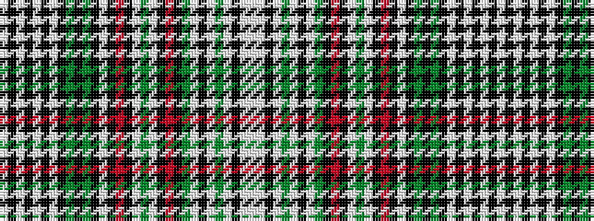

WKWKWKWKGKGKWKRKWGWKRKGWKWGWKWW

It is a 31 stripe tartan.

<figure class="pat-woven">

<figcaption>idealised sample</figcaption>
</figure>

## Colour Sequence



## Tartans with this colour sequence

| Tartans |
|---------------|
| [Pentecostal Assemblies of Canada](/variants/s31/w23k2w2k2w2k2w10k12g12k2g12k10w3k1r2k10lt8g4lt8k10r2k1g5lt23k22w2g2w2k2lt2w2~x2/)|
||
