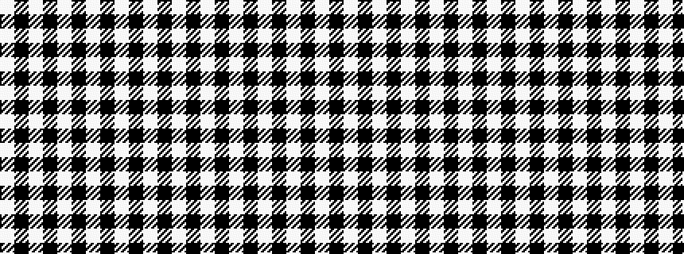

WKWKWKWKWKW

It is a 11 stripe tartan.

<figure class="pat-woven">

<figcaption>idealised sample</figcaption>
</figure>

## Colour Sequence



## Tartans with this colour sequence

| Tartans |
|---------------|
| [MacLean, Black & White](/setts/w20k6w9k6w6k12w6k48w8k16w16/)|
||
| [Scott, Sir Walter](/setts/w6k6w2k1w1k1w2k6w6k1w2/)|
||
