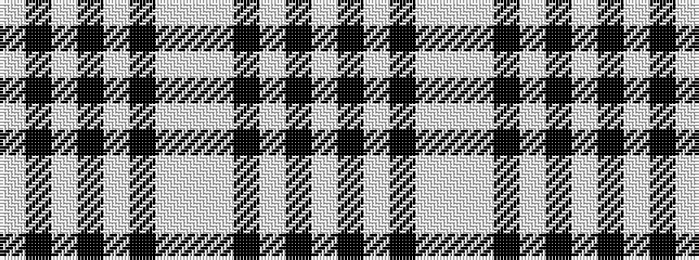

WKWKWKWWWKWKW

It is a 13 stripe tartan.

<figure class="pat-woven">

<figcaption>idealised sample</figcaption>
</figure>

## Colour Sequence



## Tartans with this colour sequence

| Tartans |
|---------------|
| [Poulter SG ? Black & white (Fashion)](/setts/s13/w25k8w8k8w8k46w46wi8w46k46w46k8w8/)|
||
