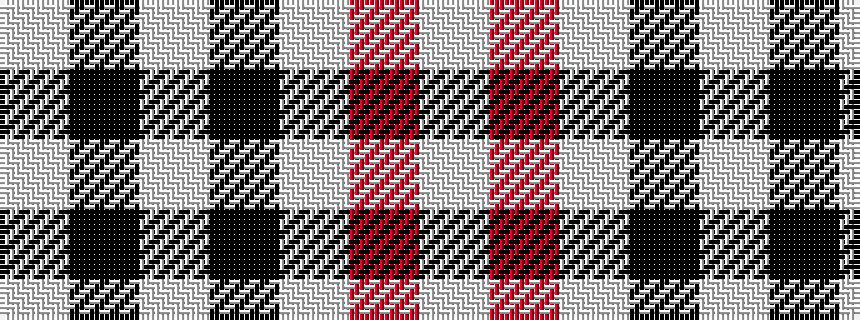

WKWKWRW

It is a 7 stripe tartan.

<figure class="pat-woven">

<figcaption>idealised sample</figcaption>
</figure>

## Colour Sequence



## Tartans with this colour sequence

| Tartans |
|---------------|
| [MacPherson of Cluny (Black and White)](/setts/s7/w5r3w35k28w4k11w2~x2/)|
||
