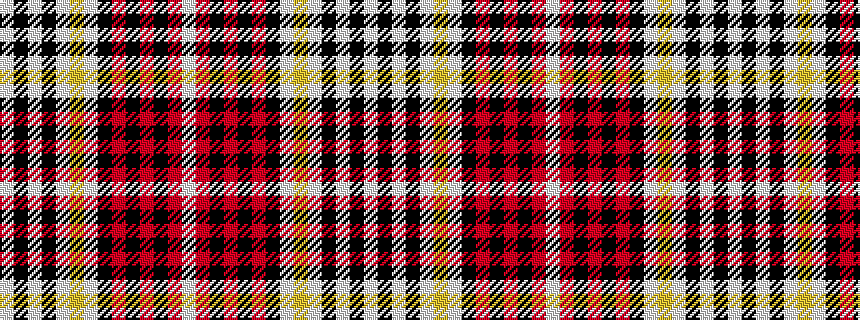

WKWKWYWKRKRKRW

It is a 14 stripe tartan.

<figure class="pat-woven">

<figcaption>idealised sample</figcaption>
</figure>

## Colour Sequence



## Tartans with this colour sequence

| Tartans |
|---------------|
| [Casey, Dress (Corporate)](/variants/s14/w7k21w9k9w29lo4w29k10r3k3r3k3r19w6/)|
||
