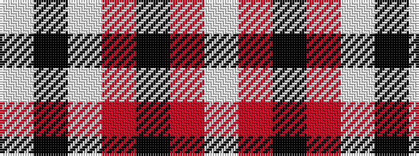

WKWRKRW

It is a 7 stripe tartan.

<figure class="pat-woven">

<figcaption>idealised sample</figcaption>
</figure>

## Colour Sequence



## Tartans with this colour sequence

| Tartans |
|---------------|
| [Russell, Ralph T. (Personal)](/setts/s7/w2k1w2r10k4r2w1~x8/)|
||
