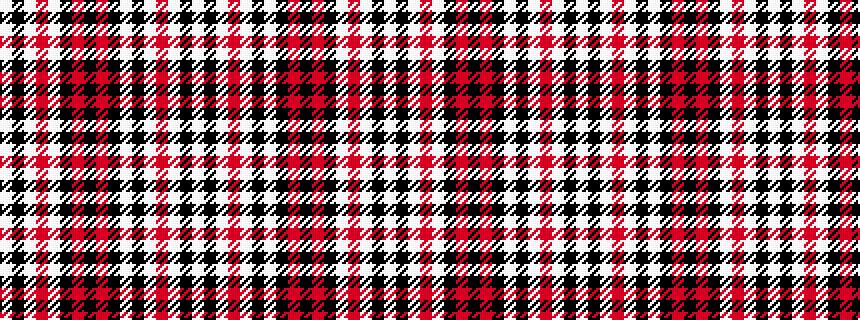

WKWRWKRKRKWKWRWKW

It is a 17 stripe tartan.

<figure class="pat-woven">

<figcaption>idealised sample</figcaption>
</figure>

## Colour Sequence



## Tartans with this colour sequence

| Tartans |
|---------------|
| [Clergy](/variants/s17/w2k10w2o8w1k52w2k20o10k4o10k20w2o8w2k10w1~x2/)|
||
