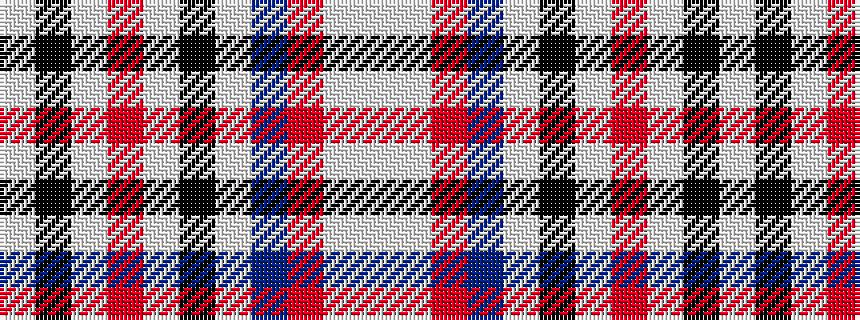

WKWRWKWBRWW

It is a 11 stripe tartan.

<figure class="pat-woven">

<figcaption>idealised sample</figcaption>
</figure>

## Colour Sequence



## Tartans with this colour sequence

| Tartans |
|---------------|
| [Hamburg #2 (Corporate)](/variants/s11/lb3k2lb3r2lb3k2lb24dt24r3lb3w2~x2/)|
||
