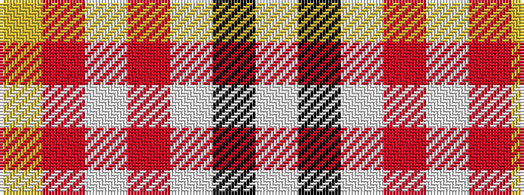

WKWRWRY

It is a 7 stripe tartan.

<figure class="pat-woven">

<figcaption>idealised sample</figcaption>
</figure>

## Colour Sequence



## Tartans with this colour sequence

| Tartans |
|---------------|
| [MacPherson Dress Burgundy (Dance)](/variants/s7/w4k2w25r21w3r8ly3~x2/)|
||
