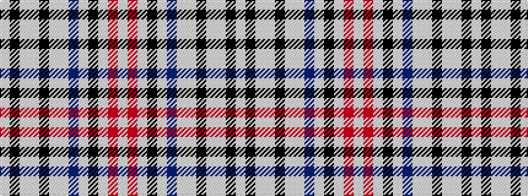

WKWWKWWBWKWRW

It is a 13 stripe tartan.

<figure class="pat-woven">

<figcaption>idealised sample</figcaption>
</figure>

## Colour Sequence



## Tartans with this colour sequence

| Tartans |
|---------------|
| [Euphoria](/variants/s13/w1r1lb8k1w1b8w1lb8k1lb1w8k1lb1~x6/)|
||
