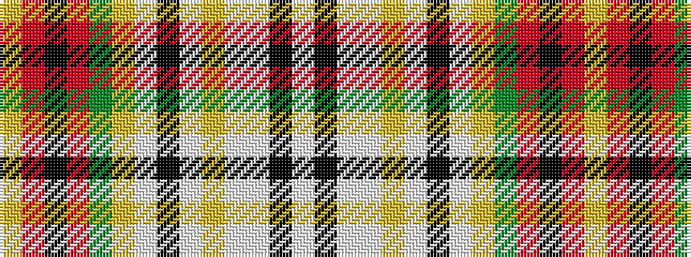

WKWWYWKWYGRKRY

It is a 14 stripe tartan.

<figure class="pat-woven">

<figcaption>idealised sample</figcaption>
</figure>

## Colour Sequence



## Tartans with this colour sequence

| Tartans |
|---------------|
| [Dundee (2003)](/variants/s14/lo35r3k21r3g21lo6w3k3w3lo6lb15w3k6w6~x2/)|
||
