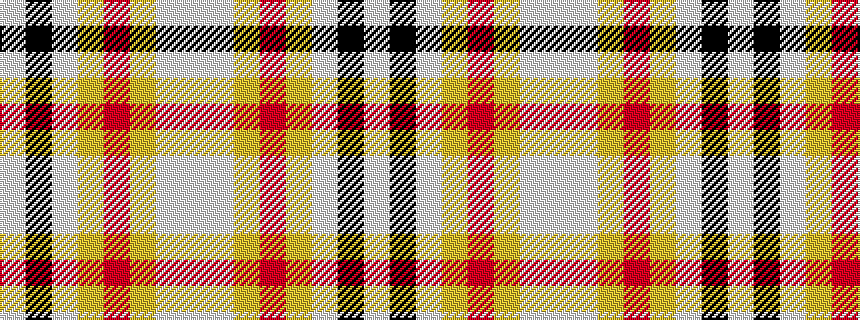

WKWYRYWW

It is a 8 stripe tartan.

<figure class="pat-woven">

<figcaption>idealised sample</figcaption>
</figure>

## Colour Sequence



## Tartans with this colour sequence

| Tartans |
|---------------|
| [Lalage (Personal)](/setts/s8/wi4k13wi17lo2r2lo24wi2w2~x2/)|
||
