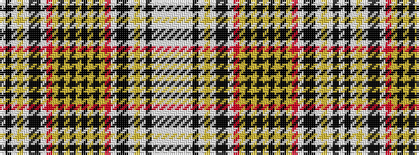

WKWYWKKWRYKYKYKYKYRWKKWYWKWWWW

It is a 30 stripe tartan.

<figure class="pat-woven">

<figcaption>idealised sample</figcaption>
</figure>

## Colour Sequence



## Tartans with this colour sequence

| Tartans |
|---------------|
| [Znaimer (Canada)](/setts/s30/lt8w21lt8w7ki2w3ly3w3k6ki6w2r8ly3k3ly3k3ly3k3ly3k3ly3r8w2k6ki6w3ly3w3ki2w7~x2/)|
||
