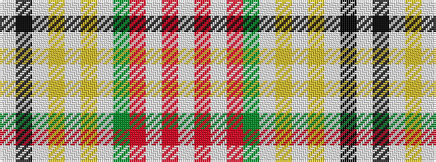

WKWYWYWGRWRW

It is a 12 stripe tartan.

<figure class="pat-woven">

<figcaption>idealised sample</figcaption>
</figure>

## Colour Sequence



## Tartans with this colour sequence

| Tartans |
|---------------|
| [Seller Dress (Personal)](/setts/s12/w63k4lb9ly2lb4ly2lb4dy11r8lb2r4w5~x2/)|
||
