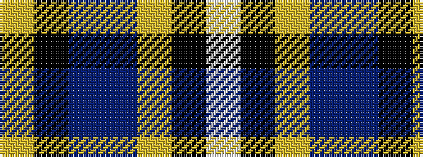

WKYBBKY

It is a 7 stripe tartan.

<figure class="pat-woven">

<figcaption>idealised sample</figcaption>
</figure>

## Colour Sequence



## Tartans with this colour sequence

| Tartans |
|---------------|
| [Mina Perhonen](/variants/s7/w4k24ly2n24t5k4ly4~x2/)|
||
