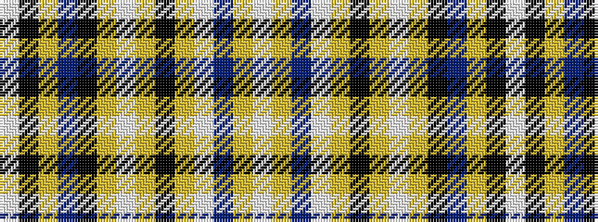

WKYBKYWYKYWBYW

It is a 14 stripe tartan.

<figure class="pat-woven">

<figcaption>idealised sample</figcaption>
</figure>

## Colour Sequence



## Tartans with this colour sequence

| Tartans |
|---------------|
| [Praetorian Imperatur (Fashion)](/variants/s14/w1k1ly1dp8k1lr1w8lr1k8lr1w1dp8lr1w1~x6/)|
||
| [Praetorian, Blue (Fashion)](/variants/s14/w1k1ly1n8k1lr1w8lr1k8lr1w1n8lr1w1~x6/)|
||
