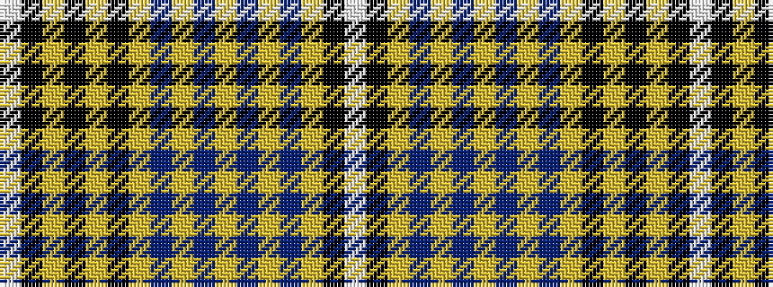

WKYBYBYBYBYKYKYKW

It is a 17 stripe tartan.

<figure class="pat-woven">

<figcaption>idealised sample</figcaption>
</figure>

## Colour Sequence



## Tartans with this colour sequence

| Tartans |
|---------------|
| [Cornish Pascoe, The](/variants/s17/w2ki32lr5dt3lr2dt3lr2dt3lr1dt6ly3ki2ly1k3ly2ki2w1~x2/)|
||
