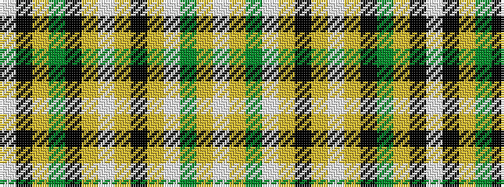

WKYGKYWYKYWGYW

It is a 14 stripe tartan.

<figure class="pat-woven">

<figcaption>idealised sample</figcaption>
</figure>

## Colour Sequence



## Tartans with this colour sequence

| Tartans |
|---------------|
| [Praetorian, Green (Fashion)](/setts/s14/w1k1ly1dg8k1lr1w8lr1k8lr1w1dg8lr1w1~x6/)|
||
