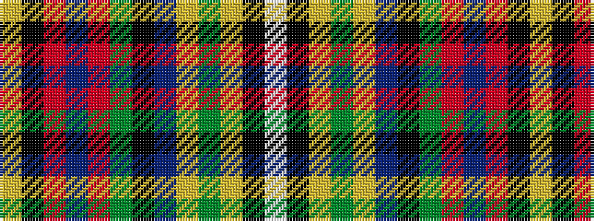

WKYGYBKGRBRKY

It is a 13 stripe tartan.

<figure class="pat-woven">

<figcaption>idealised sample</figcaption>
</figure>

## Colour Sequence



## Tartans with this colour sequence

| Tartans |
|---------------|
| [Robieson Playfield](/setts/s13/w1k1ly8g1ly1db8k1g8r1db1r8k1ly1~x6/)|
||
| [Robieson Playfield (School)](/setts/s13/w1k1ly8dg1ly1db8k1dg8r1db1r8k1ly1~x6/)|
||
