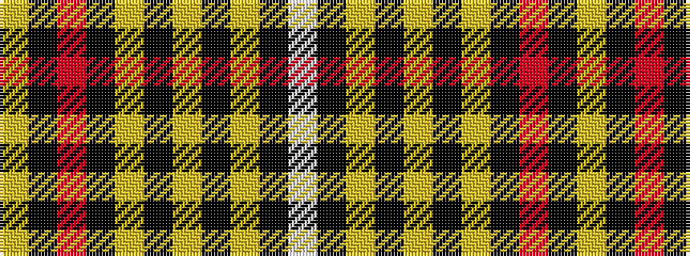

WKYKYKYKRKY

It is a 11 stripe tartan.

<figure class="pat-woven">

<figcaption>idealised sample</figcaption>
</figure>

## Colour Sequence



## Tartans with this colour sequence

| Tartans |
|---------------|
| [Livingston Football Club](/variants/s11/ly11k4m2k3lyi2k4ly15k32ly2k5w2~x2/)|
||
