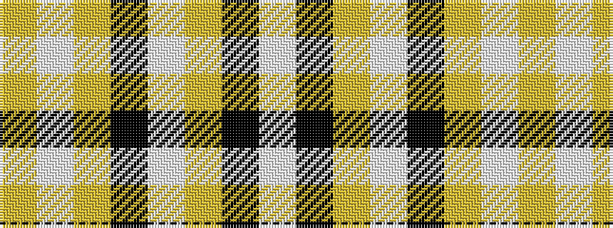

WKYWKYWY

It is a 8 stripe tartan.

<figure class="pat-woven">

<figcaption>idealised sample</figcaption>
</figure>

## Colour Sequence



## Tartans with this colour sequence

| Tartans |
|---------------|
| [Guzzo Check (Personal)](/variants/s8/ly20w2ly20k4w3ly3k3w2/)|
||
